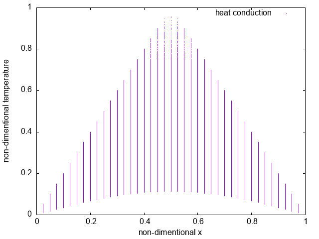
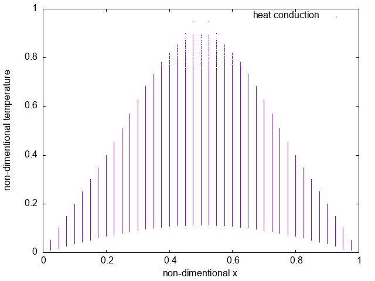

# heat conduction
## output

## time
```
________________________________________________________
Executed in  149.54 secs   fish           external 
   usr time   61.61 secs  853.00 micros   61.61 secs 
   sys time   53.66 secs  998.00 micros   53.66 secs 
```
# theoretic heat conduction
## output

## time (N=3)
```
________________________________________________________
Executed in  233.36 secs   fish           external 
   usr time   74.95 secs    0.00 millis   74.95 secs 
   sys time   93.67 secs    2.68 millis   93.67 secs 
```